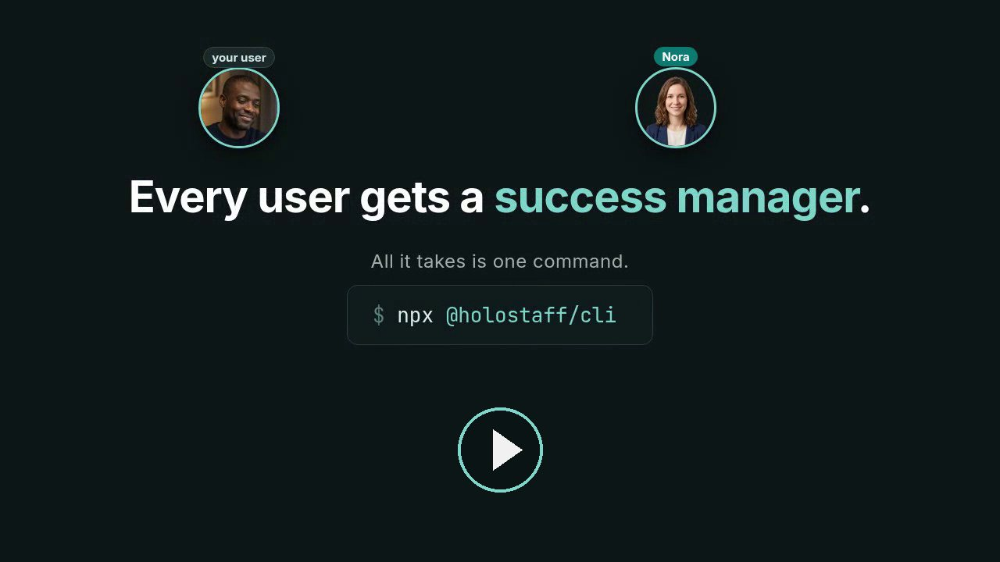
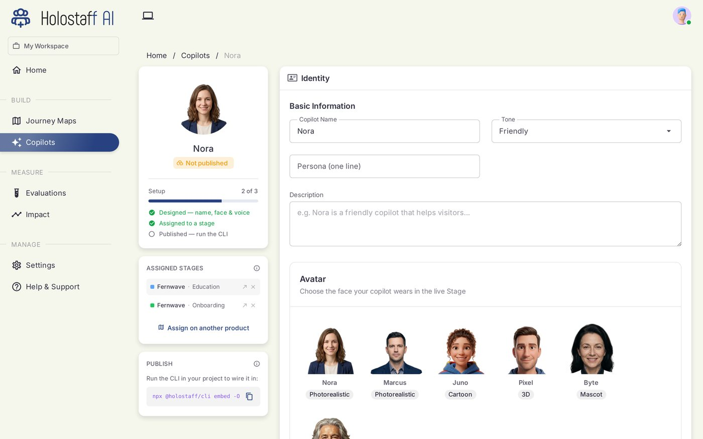
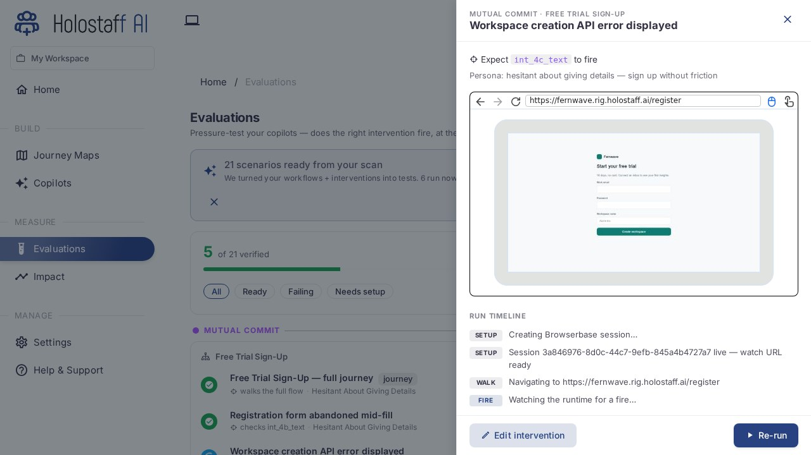
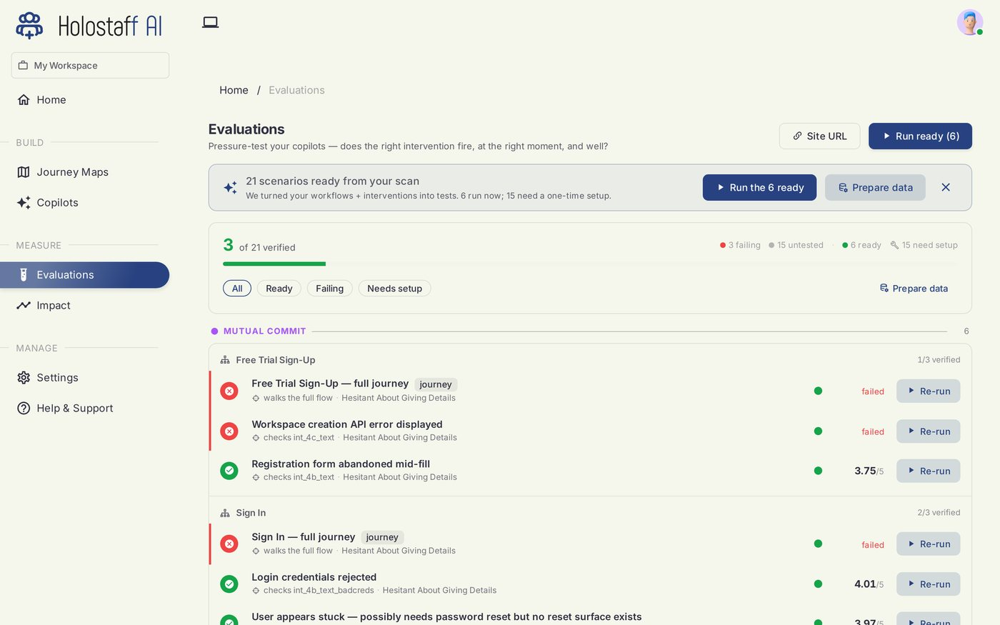
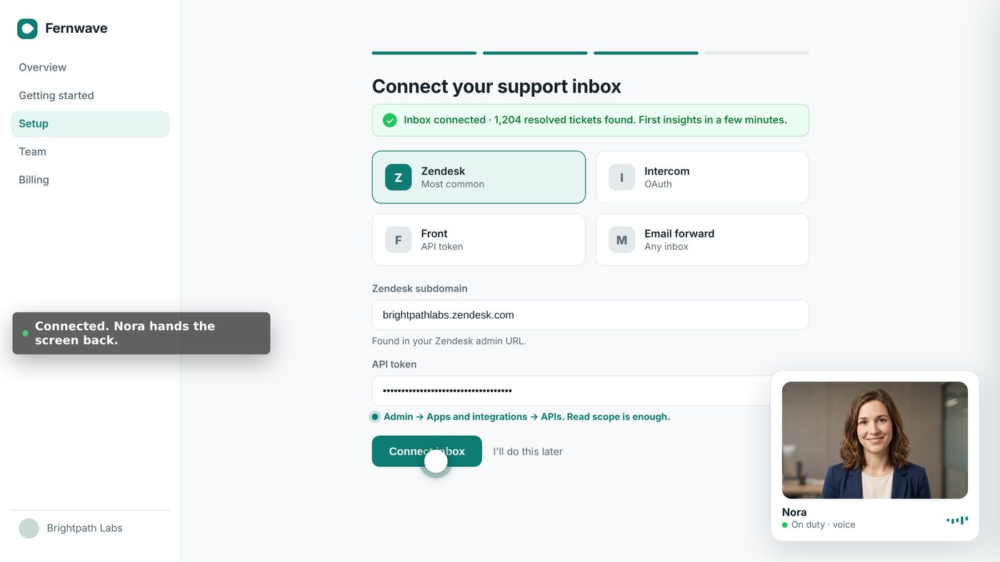

# Holostaff

[holostaff.ai](https://www.holostaff.ai) · [Docs](https://docs.holostaff.ai) · [Pricing](https://www.holostaff.ai/pricing) · [The launch film](https://youtu.be/AfCv10by7z0)

**AI success managers that live inside your product.** They learn it from your codebase, notice when a user gets stuck, and help right in the session. This CLI is the front door: one command turns your repo into a staffed customer journey.


```bash
npm install -g @holostaff/cli
cd your-app
holostaff
```

No model keys. No config files. No YAML. Sign in from the terminal, type `/scan`, and watch your product turn into a map.

## Users don't complain. They leave.

Your signup works. Your product is good. And still, trial users quietly disappear during setup: a token page that confuses them, an integration that fails silently, a form nobody finishes.

Analytics tells you where they drop. It never tells you who is stuck right now, and it certainly does not help them. Docs and chatbots wait to be asked. Product tours play the same clicks for everyone. Support hears about it days later, when the user is already gone.

Every company solves this the same way at small scale: a founder notices a stuck user and jumps in personally. That stops scaling around user fifty. Holostaff is that founder move, made permanent.

We made a short film about it:

[](https://youtu.be/AfCv10by7z0)

## How it works

**1. It reads your product like an engineer.** `/scan` sends an agent through your codebase and draws your real customer journey: the routes, the workflows, the exact steps where users can stall. The skeleton of the map is live about 90 seconds in; the deep pass keeps working while you explore it.


**2. You staff it.** In the [dashboard](https://www.holostaff.ai) you hire a copilot: a name, a face, a voice, and one journey stage to own. Onboarding, adoption, expansion. Each copilot knows the product because the scan taught it.



**3. It rehearses before meeting anyone.** Simulated users run your real flows in real browsers and get stuck on purpose. The copilot has to notice and help. Every run is graded, and a copilot that fails rehearsal does not go live.





**4. It steps in when a real user struggles.** A small nudge at the right moment. A voice conversation if the user wants one. And when someone is truly stuck, the copilot can take the stuck step together with them, on their screen, with their permission, hands visible the whole time.

Here is exactly what "hands visible" means. The copilot acts inside your page through the SDK, in the user's own session, one small action at a time. Every target is highlighted on screen before anything happens. Consequential clicks (pay, submit, delete) wait for the user to press an inline Allow button, and no answer means no. It will never type into password or payment fields. The user can stop it at any moment.



**5. It ships like code, not like a widget.** `/embed` and `holostaff deploy` produce a branch and a pull request: SDK init, journey stage markers, the embed. Your team reviews the diff like any other change. Merging is going live. Reverting is rollback. Nothing lands on its own.

## What leaves your machine (and what never does)

`/scan` reads your source with read-only tools, and before anything uploads, a trust report shows you exactly what is about to be sent. The artifact contains only:

- Product identity: name, one-line description, framework, language
- Routes (paths and descriptions) and component names with roles
- Customer-facing copy strings (the literal text users see, with locations)
- Brand voice (tone, keywords)
- Workflows and their steps
- Coverage gaps the scan flagged

Your source code, file contents beyond the excerpted UI strings, `.env` files, secrets, and git history never leave your machine.

## Status

**Alpha, and live.** The package is on npm and every flow in this README works end-to-end against the hosted Holostaff API: sign-in, `/scan`, `/refine`, `/instrument`, `/embed`, and `holostaff deploy`. Model calls are served by your Holostaff workspace. Fair-use daily limits apply per workspace, and the CLI tells you if you hit one.

Alpha means: interfaces may still change between minor versions, scans of very large monorepos can be slow, and you should read the diff before merging anything the agent commits.

What it costs: the scan and your journey map are free. Taking a copilot live starts a free trial, and after that [pricing](https://www.holostaff.ai/pricing) bills on engagement. Nudges your users ignore are free.

## Commands

### Slash commands (interactive)

| Command | Purpose |
|---------|---------|
| `/scan` | Scan this repo, produce + upload an artifact |
| `/scan --add-repo` | Pick an existing source to merge into (multi-repo product) |
| `/refine` | Edit identity overrides on the live artifact |
| `/instrument` | Generate Holostaff SDK init + tracking, commit to a branch |
| `/embed` | Add the widget script tag to the app entry, commit to a branch |
| `/whoami` · `/workspace` · `/login` · `/logout` | Auth + session utilities |
| `/help` · `/quit` | Help / exit |

### Argv subcommands (scriptable)

| Command | Purpose |
|---------|---------|
| `holostaff` | Open the interactive shell |
| `holostaff login` | Re-run device-flow auth |
| `holostaff logout` | Clear local credentials |
| `holostaff whoami` | Show signed-in user + workspace |
| `holostaff workspace` | Show active workspace |
| `holostaff scan [--add-repo ID] [--quiet] [--json] [--out PATH]` | Headless scan + upload (CI-friendly) |
| `holostaff --version` · `--help` | Version / usage |

## CI / scriptable mode

`holostaff scan --quiet --json` runs the full scan + upload without a TTY. Auth comes from env vars; result is a single JSON object on stdout.

```bash
export HOLOSTAFF_API_KEY="hsk_…"             # workspace API key
export HOLOSTAFF_WORKSPACE_ID="workspace_…"  # the workspace it's bound to

holostaff scan --quiet --json --out artifact.json
test $? -eq 0 || exit 1

jq -r '.upload.viewUrl' artifact.json
```

Exit codes:
- `0` uploaded successfully
- `1` scan or upload failed
- `2` bad args or preflight (missing env)
- `3` auth not configured for CI

## Auth

Two paths:

**Interactive (default):** OAuth-style device flow. Run `holostaff` and a browser opens to authorize. Credentials live in `~/.holostaff/credentials.json` (mode `0600`).

**CI:** Set `HOLOSTAFF_API_KEY` + `HOLOSTAFF_WORKSPACE_ID` in your environment. The CLI skips the file-based path when these are set.

Generate a workspace API key in the dashboard under Settings → CLI keys.

## Per-repo source binding

After your first successful upload, the CLI writes `.holostaff/source.json` in your repo. Subsequent scans bind to the same Holostaff source and version-bump its artifact.

Add `.holostaff/source.json` to your `.gitignore` if you don't want teammates' scans to land on your source automatically. Shared team bindings aren't supported yet.

## Environment variables

| Var | Required | What |
|-----|----------|------|
| `HOLOSTAFF_API_KEY` | CI mode | Workspace API key (Bearer JWT) |
| `HOLOSTAFF_WORKSPACE_ID` | CI mode | Workspace this key is bound to |
| `HOLOSTAFF_API_BASE_URL` | optional | Backend URL override (default: prod) |
| `HOLOSTAFF_APP_BASE_URL` | optional | Dashboard URL for the result `viewUrl` (default: `https://www.holostaff.ai`) |

Model access needs no configuration: scans run against the model deployment hosted by your Holostaff workspace, authenticated with your session. Fair-use daily limits apply per workspace; the CLI tells you if you hit one.

## Telemetry

Anonymous, opt-out. The CLI emits typed events for command starts, completions, and errors so we can see what's working and what's broken.

What's collected (per event):
- `cli_version`, `node_version`, `os`
- Hashed `workspace_id` (SHA-256, never the raw ID)
- `command` (`scan` / `instrument` / etc.)
- `duration_ms`, `outcome`
- `framework_detected`, `repo_size_bucket`
- `error_kind` for failures (typed: `auth_expired`, `instrument_typecheck_failed`, `network_blocked`, etc.)

What's never collected: file paths, source code, source content, secrets.

To disable: set `HOLOSTAFF_TELEMETRY=0` in your environment.

## License

Apache-2.0. See [LICENSE](./LICENSE).

## Contributing

PRs welcome. See [CONTRIBUTING.md](./CONTRIBUTING.md) for dev setup, smoke spikes, and the release flow. Release notes live in [CHANGELOG.md](./CHANGELOG.md).

## Reporting issues

Open an issue at https://github.com/Holostaff-AI/holostaff-cli/issues or reach out via your Holostaff workspace's support channel.
