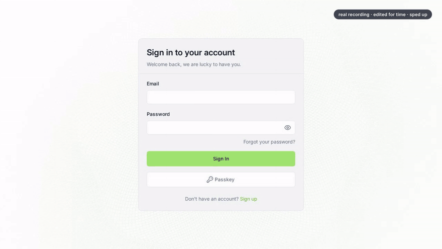
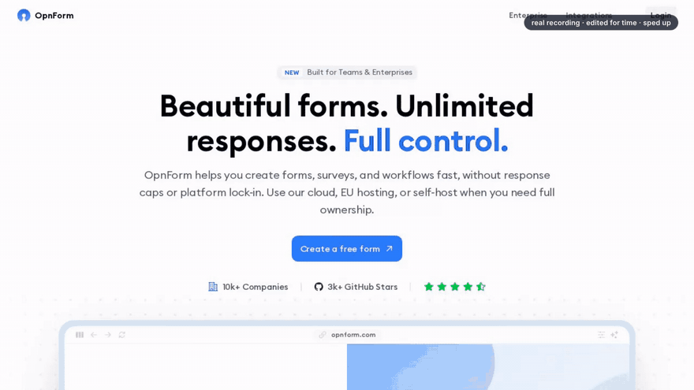
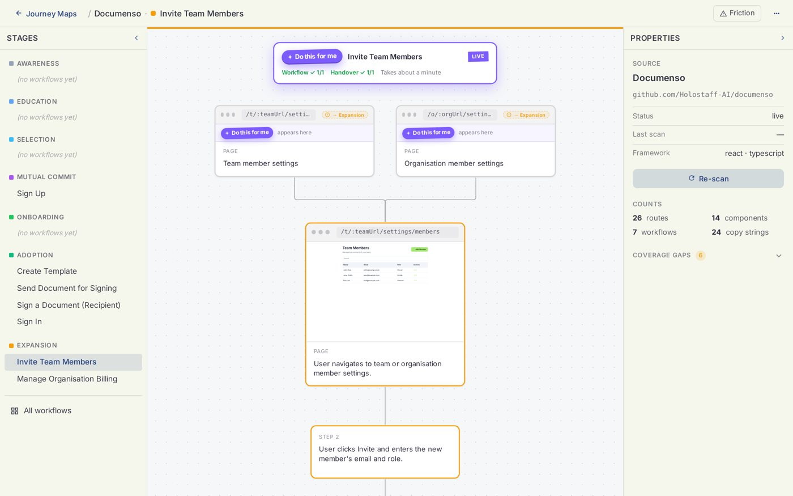

<p align="center"><a href="https://www.holostaff.ai"></a></p>

[](https://www.npmjs.com/package/@holostaff/cli)
[](./LICENSE)
[](#)
[](./CHANGELOG.md)

A user clicks the button. An agent does the task for them, on their screen, in their own session. It asks before anything that pays, sends, or deletes. We call it a workflow autopilot.

Two real handovers on real open-source apps. Nothing staged, edited for time.

| Document signing app: invite a teammate | Form builder: build and publish a form |
| --- | --- |
|  |  |

[holostaff.ai](https://www.holostaff.ai) · [Live map, no sign-up](https://www.holostaff.ai/journey-maps/ks_msej1m5f_08yytu/canvas) · [Docs](https://docs.holostaff.ai) · [Pricing](https://www.holostaff.ai/pricing) · [Security](https://www.holostaff.ai/security)

## Contents

- [Get started](#get-started)
- [What it is](#what-it-is)
- [What lands in your codebase](#what-lands-in-your-codebase)
- [Safety rules](#safety-rules)
- [How it works](#how-it-works)
- [Your data](#your-data)
- [Pricing](#pricing)
- [Status](#status)
- [Commands](#commands)
- [CI mode](#ci-mode)
- [Auth, config, telemetry](#auth-config-telemetry)
- [License and contributing](#license-and-contributing)

## Get started

```bash
npm install -g @holostaff/cli
cd your-app
holostaff
```

Then type `/scan`. Sign in when asked. In about two minutes you have a map of your product's workflows.

No model keys. No config. No YAML. Works with React, Next.js, Vue, Nuxt, Remix, SvelteKit, Astro, and Express.


Not ready to install? [Open a live map](https://www.holostaff.ai/journey-maps/ks_msej1m5f_08yytu/canvas). It is Documenso, scanned by this CLI. Nothing on it was edited.

## What it is

- **Not a chatbot.** It never chats. It acts.
- **Not a product tour.** A tour explains the task. An autopilot does it.
- **Not an outside browser agent.** It runs inside your page, under rules you review in a pull request.

This repo is the CLI. It scans your repo and draws the map. The agent that runs in your app is `@holostaff/sdk`, added later by one PR.

## What lands in your codebase

One pull request, opened by `holostaff deploy`. You review it. Merging is going live. Reverting is rollback.

```diff
+ import { holostaff } from '@holostaff/sdk'
+
+ // Once at app startup.
+ holostaff.init({ sourceId: 'cli-source-abc', tenantId: 'your-tenant-id' })
+
+ // Optional. Once when a user reaches a milestone, for example after onboarding.
+ holostaff.markStageEntry('onboarding')
+
+ // On sign-in / sign-out.
+ holostaff.identify(user.id)
+ holostaff.clearIdentity()
```

The SDK draws the button, the run, the questions, the Allow pill, and the Stop. You write none of it. Revert the PR and all of it is gone.

- About 80 KB gzipped, loaded once.
- Talks to one host: your Holostaff workspace. No trackers.
- Records the page structure and visible text so the agent can see the screen. Password, email, and phone fields are always masked. Add `holostaff-mask` or `holostaff-block` to anything else private. Nothing is sent before the user's first real click. Turn it off per host with `observe: { enabled: false }`.
- Uninstall: revert the PR, delete `.holostaff/` in your repo and `~/.holostaff/credentials.json`.

## Safety rules

Enforced in the runtime, not in a prompt. Not configurable per autopilot.

- Every target is highlighted on screen before it is clicked.
- Pay, submit, delete, send, sign: the user presses **Allow** first. No answer means no.
- It never types into password, payment, or code fields. It points. The user types.
- Any keystroke from the user pauses it.
- **Stop** never leaves the screen.

## How it works

1. **Map.** `/scan` reads your repo and draws your workflows. The map is live in about 90 seconds; the deep pass keeps going while you look.
2. **Rehearse.** Synthetic users run each workflow in a real browser against the URL you set (use staging). Every run is recorded and graded.
3. **Certify.** An autopilot ships only while every run in its suite passes. Suites gate every PR.
4. **Deploy.** `holostaff deploy` opens the PR above.
5. **Verify.** Every handover is logged and counted only when the task actually got done.



Gate pull requests with the [GitHub Action](https://github.com/Holostaff-AI/simulate-action):

```yaml
- uses: Holostaff-AI/simulate-action@v1
  with:
    api-key: ${{ secrets.HOLOSTAFF_API_KEY }}
    source-id: ks_your_source_id
```

The PR comment reads `workflow certified (n/n runs)` when the suite passes.

## Your data

The scan runs on your machine. Before anything uploads, a trust report shows the exact artifact. It holds only:

- Product name, description, framework, language.
- Routes and component names with roles.
- The copy strings users see, with file locations.
- Brand voice, workflows and their steps, coverage gaps.

Your source code, `.env` files, secrets, and git history never leave your machine.

Hosting regions, retention, deletion, DPA: [holostaff.ai/security](https://www.holostaff.ai/security). Vulnerabilities: [SECURITY.md](./SECURITY.md).

## Pricing

Scan and map are free, no card. Going live starts a 14-day trial.

| | Team | Growth |
| --- | --- | --- |
| Platform | $99/mo | $299/mo |
| Simulation runs included | 300, then $0.49 | 1,500, then $0.29 |
| Completed handovers included | 100, then $0.99 | 500, then $0.69 |

A handover that stops or fails costs nothing. [Full pricing](https://www.holostaff.ai/pricing).

## Status

**Alpha, and live.** Every flow in this README works end to end against the hosted service. Interfaces may change between minor versions. Read the diff before merging anything the agent commits. Releases are tagged and listed in the [changelog](./CHANGELOG.md).

## Commands

<details>
<summary>Slash commands (interactive)</summary>

| Command | Purpose |
| --- | --- |
| `/scan` | Scan this repo, build and upload the map |
| `/scan --add-repo` | Merge into an existing source (multi-repo product) |
| `/refine` | Edit identity overrides on the live map |
| `/instrument` | Add SDK init and stage markers on a branch |
| `/embed` | Add the autopilot layer to the app entry on a branch |
| `/whoami` `/workspace` `/login` `/logout` | Auth and session |
| `/help` `/quit` | Help, exit |

</details>

<details>
<summary>Argv subcommands (scriptable)</summary>

| Command | Purpose |
| --- | --- |
| `holostaff` | Open the interactive shell |
| `holostaff scan [--add-repo ID] [--quiet] [--json] [--out PATH]` | Headless scan and upload |
| `holostaff deploy [--dry-run] [--force]` | Open the deploy PR |
| `holostaff import NAME` | Import a preset map instead of scanning (`import` alone lists them) |
| `holostaff login` `logout` `whoami` `workspace` | Auth and session |
| `holostaff --version` `--help` | Version, usage |

</details>

## CI mode

```bash
export HOLOSTAFF_API_KEY="hsk_…"             # workspace API key (Settings → CLI keys)
export HOLOSTAFF_WORKSPACE_ID="workspace_…"
holostaff scan --quiet --json --out artifact.json
jq -r '.upload.viewUrl' artifact.json
```

Exit codes: `0` uploaded, `1` scan or upload failed, `2` bad args or missing env, `3` auth not configured.

For PR gating use the [GitHub Action](https://github.com/Holostaff-AI/simulate-action).

## Auth, config, telemetry

<details>
<summary>Auth</summary>

Interactive: run `holostaff`, a browser opens to authorize. Credentials live in `~/.holostaff/credentials.json` (mode `0600`). CI: set `HOLOSTAFF_API_KEY` and `HOLOSTAFF_WORKSPACE_ID`; the CLI skips the file when both are set.

</details>

<details>
<summary>Per-repo source binding</summary>

After the first upload the CLI writes `.holostaff/source.json`. Later scans bind to the same source and version-bump its map. Add the file to `.gitignore` if you do not want teammates' scans landing on your source. Shared team bindings are not supported yet.

</details>

<details>
<summary>Environment variables</summary>

| Variable | When | What |
| --- | --- | --- |
| `HOLOSTAFF_API_KEY` | CI | Workspace API key |
| `HOLOSTAFF_WORKSPACE_ID` | CI | Workspace the key is bound to |
| `HOLOSTAFF_API_BASE_URL` | optional | Backend URL override |
| `HOLOSTAFF_APP_BASE_URL` | optional | Dashboard URL for `viewUrl` |
| `HOLOSTAFF_TELEMETRY` | optional | `0` turns telemetry off |

Model access needs no configuration. Scans run through your Holostaff workspace. Fair-use daily limits apply and the CLI tells you if you hit one.

</details>

<details>
<summary>Telemetry</summary>

Anonymous, opt-out. Per event: CLI and Node versions, OS, a hashed workspace id, command name, duration, outcome, detected framework, repo size bucket, typed error kind. Never file paths, source, or secrets. `HOLOSTAFF_TELEMETRY=0` turns it off.

</details>

## License and contributing

Apache-2.0. PRs welcome; see [CONTRIBUTING.md](./CONTRIBUTING.md) for dev setup and the release flow. Bugs and ideas: [issues](https://github.com/Holostaff-AI/holostaff-cli/issues).
